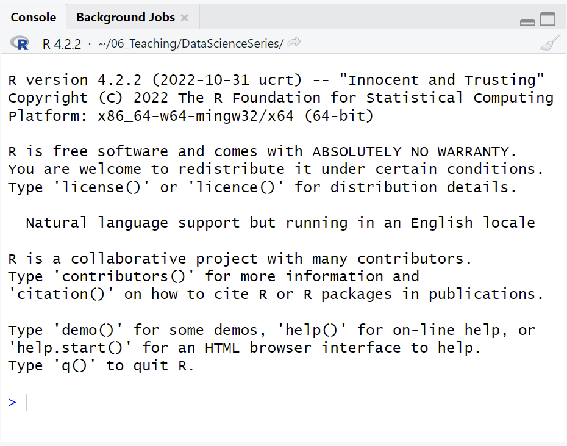
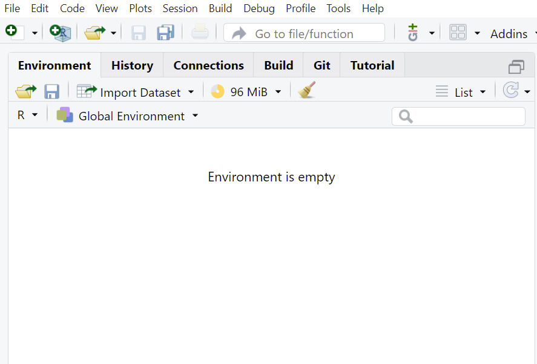
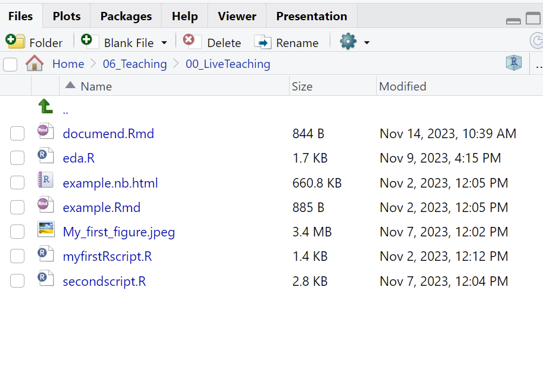

## Installing R and R studio

R programming language which originally started as a statistical computing language. RStudio is the IDE (integrated development environment) used for coding and running analysis in R programming language. You can either download a desktop version ( open source, free of cost) or can use the RStudio remote server using a web browser. You can download [R](https://cran.r-project.org/) and [RStudio](https://posit.co/download/rstudio-desktop/).

## The basics : Using RStudio and R

The three panes are

1.  Console - used for running the code

    {width="336"}

2.  Environment - has information about the loaded variables and history of commands run (it also has shortcuts for uploading datasets and saving workspace)

    {width="342"}

3.  Help pane - gives you access to files, plots and package information. Also helpful in saving plots.

    {width="345"}

You can change where the console is in Rstudio by going to View-\>Pane-\>Console on Right. You can also change how the panes look in Rstudio by going to View-\>Pane-\>Pane Layout

## File and Project management

### Rscript

Creating a new R script in RStudio:

1.  Click the "File" menu button, then "New File".
2.  Click "R script".

### R Notebook and R markdown

Creating a new R script in RStudio:

1.  Click the "File" menu button, then "New File".
2.  Click "R markdown".
3.  Enter "title" and "author" name
4.  Choose output format

### R Project

Creating a new project in RStudio:

1.  Click the "File" menu button, then "New Project".
2.  Click "New Directory".
3.  Click "New Project".
4.  Type in the name of the directory to store your project, e.g. "my_project".
5.  Select the checkbox for "Create a git repository" for version control.
6.  Click the "Create Project" button.

## Arithmetic operators and comparisons

We can use R for basic arithmetic calculations

### Basic calculation

```{r}
# Calculations

1+1 # addition
1-5 # subtraction
1*3 # multiplication 
1/6 # division

# Comparisons; evaluates the statement 

1==1  # equal to comparison; this statement evaluates to TRUE
1!=1  # not equal comparison; evaluates to FALSE
1!=2  # not equal comparison; evaluates to TRUE
1>2   # greater than comparison; evaluates to FALSE
1>=2  #
```

### Comments in R

```{r}
# single line comment
# 1+1

1+1

"
Multi line comment
1>2   
1>=2
1/6

Everything between quotes

"

```

### Useful Inbuild Functions in R

```{r}
#Trig functions
sin(1)
cos(1)

# log functions
log(1)
log10(2)

# exponential
exp(1)
```

### Variable assignment

\<- is the assignment operator. You can also use = operator i.e. equals to sign. Please make sure there is no space between \< and -

**Shortcut:** Press alt and - together and you will get \<-

```{r}
x <- 5/9
x

x <- x + 1 # variables can also be used to reassign
x

# Note that the following two lines of code are same

# x = 8 
# x <- 8
```

#### Rules for variable assignment:

1.  Valid variable names cannot start with a special character or number.

2.  Periods, numbers and underscore are allowed within variable names.

3.  Variable names are case sensitive in R. For example, variables names data.new and data.New are NOT the same.

4.  Variable names can have numeric values within.

Some examples of allowed variable names:

-   x_new
-   x.new
-   xNew
-   xNEW
-   Newx
-   NEW
-   Newx2
-   NEW2x
-   NEW2_x

### Vectors

Vectors are the most basic R data objects and there are six types of atomic vectors. They are logical, integer, double, complex, character and raw.

```{r}
1:10 # is a sequence from 1 to 10
x <- 1:10

# indexing a vector # Index in R starts at 1
x[5] # this outputs the 5th element in the vector 5

# subsetting a vector
x <- 10:20 # this is a vector from 10 to 20
x[4:5] # subsetting the element 4th the 5th from the vector

```

#### Using function to create vectors:

```{r}
# Vector types
x.num<-c(1,7,8,16,245) # numeric vector
str(x.num)
x.log<-c(TRUE,FALSE,TRUE,FALSE,FALSE) # logical vector
str(x.log)
x.char<-c("A", "B", "C","D","E","F") # Character vector
str(x.char)
```

#### Changing vector types:

```{r}
as.character(x.num) # changing the vector from numeric to character
str(as.character(x.num)) 
x.num<-c("1","7","8","16","245")
str(x.num)
as.numeric(x.num)
str(as.numeric(x.num))

```

#### seq and rep functions:

```{r}
seq(from=1,to=10)
seq(from=-1,to=-10)
seq(from=3,to=30,by=3)
dat.seq<-seq(from=1,to=300,by=4)
length(dat.seq)

# rep function
rep(1:3,5) # the sequence 1:3 is repeated 5 times
```

## Installing packages

```{r}
#install.packages("ggplot2") # installing packages
library(ggplot2) # using packages 
require(ggplot2) # using packages 
#update.packages(ggplot2) # updating packages
#remove.packages(ggplot2) # removing packages
```

## Getting help

```{r}
#? # help with a function
#?? # Fuzzy search
#sessionInfo() # prints out current version and packages loaded
```

## Common R mistakes and how to avoid them

1.  Wrong paths: Make sure you understand the difference between absolute and relative paths of files. Most common errors the beginners face are not being able to load their data because of being in the wrong working directory. Set your working directory at the beginning of R session and make sure your file paths are correctly set.

2.  Pay attention to Errors: If you are a new user or running a new script, make sure to run it line by line to troubleshoot the line giving you the error. Read the error if you are not able to figure it out, copy and paste the error into the search engine.

3.  Not Utilizing available help: Use Help pane, Stackoverflow , Rbloogers or R community available online and at your institution.
