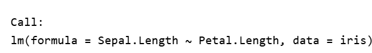
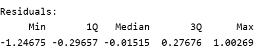
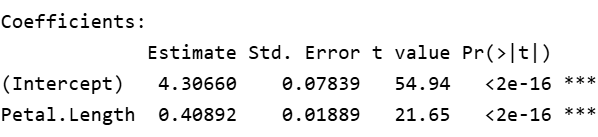
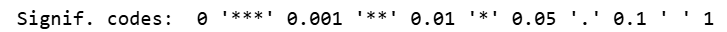
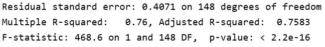

### Previous workshops

[Workshop Series Content](https://natyahans.github.io/DataScienceSeries/)

```{r, echo=FALSE}
library(DiagrammeR)
mermaid("
graph LR
  A(Intro to R) --> B(Data Structures in R)
  B --> C(Data Visualization)
  C --> D(Exploratory Data Analysis)
")
```

### Statistical Analysis using R

#### Workshop Expectations:

1.  Not a workshop to teach Statistics, participants should be familiar with common stats terms. [Click here for stats terms](https://bookdown.org/mikemahoney218/LectureBook/basic-statistics-using-r.html)

2.  Basic knowledge of R programming language expected. ( Please make sure you are familiar with the content from the first 4 workshops)

### Set up:

Please note if you haven't installed these packages already use `install.packages("NAMEOFPACKAGE")`

```{r settings2, echo=TRUE, warning=FALSE}
library(tidyverse)
library(ggplot2)
knitr::opts_chunk$set(fig.width=6, fig.height=5) 
```

### Dataset used:

Iris data set has 150 observation with 5 variables as columns. It is a great example of a tidy data format. Note that each observation is a row (150) and each variable is a column (5): Sepal.Length; Sepal.Width, Petal.Length, Petal.Width and Species.

### Attaching and eploring dataset

```{r}
data()  # Exploring different in build dataset
data("iris") # attaching in build dataset
head(iris) # the first 6 lines of the dataset
```

```{r}
# Viewing dataset
View(iris)
# structure of data
str(iris) 
```

### Descriptive Statistics

-   n: The number of observations of a data set or level of a categorical.

```{r}
# Count number of observations
nrow(iris) 

# Count by variable name
count(iris, Species) 
```

-   min value and max values

```{r}
# min value in the vector
min(iris$Sepal.Length) 

#max in the vector
max(iris$Sepal.Length)

# Plotting
plot(iris$Sepal.Length, ylab = "Sepal Length", xlab = "Observations")

# range
max(iris$Sepal.Length) - min(iris$Sepal.Length)

```

-   Mean: The average value of a data set or sum of all observations divided by the number of observations.

-   Trimmed mean: The mean of a data set with a certain proportion of data not included. The highest and lowest values are trimmed, the 10% trimmed mean will use the middle 80% of your data.

```{r}
mean(iris$Sepal.Length)
mean(iris$Sepal.Length, trim = 0.10)

summary(mean(iris$Sepal.Length, trim = 0.10))
```

-   Variance: A measure of the spread of your data.

```{r}
var(iris$Sepal.Length)
```

-   Standard Deviation (SD): The amount any observation can be expected to differ from the mean.

```{r}
sd(iris$Sepal.Length)
```

-   Standard Error(SE): The error associated with a point estimate (e.g. the mean) of the sample.

-   Formula SE = SD / √n ; where n is number of observations

```{r}
n.obs<-length(iris$Sepal.Length)
standarderror<-sd(iris$Sepal.Length)/sqrt(n.obs)
standarderror
```

-   Median: estimate of the center of the data.

```{r}
median(iris$Sepal.Length)
```

-   The n quantile is the value at which, for a given vector, n percent of the data is below that value.

-   Ranges from 0-1.

-   Quantile \* 100 = percentile.

-   Quartiles are the 0.25, 0.5, and 0.75 quantiles

```{r}
quantile(iris$Sepal.Length, c(0.25, 0.5, 0.75))
```

-   Interquartile range: The middle 50% of the data, contained between the 0.25 and 0.75 quantiles

```{r}
IQR(iris$Sepal.Length)
```

### Correlation

-   Measure of how closely related two variables are

-   Pearson’s test assumes your data is normally distributed and measures linear correlation

-   Spearman’s test does not assume normality and measures non-linear correlation

-   Kendall’s test also does not assume normality and measures non-linear correlation, and is a more robust test - but it is harder to compute by hand

-   The following two functions:

    <div>

    -   cor() : computes the correlation coefficient

    -   cor.test() : test for association/correlation between paired samples. It returns both the correlation coefficient and the significance level(or p-value) of the correlation.

    </div>

#### Pearson's

```{r}
# Correlation between two numeric variable
# Default method: Pearson
cor(iris$Sepal.Length, iris$Sepal.Width, method = "pearson")

cor.test(iris$Sepal.Length, iris$Sepal.Width, method = "pearson")
cor.result<-cor.test(iris$Sepal.Length, iris$Sepal.Width, method = "pearson")
```

-   Interpreting the output:

    <div>

    -   t is the t-test statistic value;

    -   df is the degrees of freedom;

    -   p-value is the significance level of the t-test;

    -   conf.int is the confidence interval of the correlation coefficient at 95%;

    -   sample estimates is the correlation coefficient(Cor.coeff)

    </div>

```{r}
# Extract the p.value
cor.result$p.value
# Extract the correlation coefficient
cor.result$estimate
```

#### Spearman's

```{r}
# Spearman's correlation
cor.test(iris$Sepal.Length, iris$Sepal.Width, method = "spearman")
```

#### Kendall's

```{r}
# Kendall's correlation
cor.test(iris$Sepal.Length, iris$Sepal.Width, method = "kendall")
```

### Regression

```{r}

# lm(y~x)
model1<-lm(Sepal.Length~Petal.Length,data=iris)

summary(model1)

plot(model1)

# Other useful functions

# model coefficients
coefficients(model1)

# CIs for model parameters
confint(model1, level=0.95)  

# residuals
residuals(model1) 

## residuals
plot(residuals(model1)) 
```

### Interpretation of the linear regression output

#### Call function

{width="336"}

The call function describes the formula we are using for our linear regression model.In the example, we are using Petal.Length variable as the independent variable (x) and Sepal.Length as the dependent variable (y) from the iris dataset.

#### Residuals

{width="336"}

Remember that residuals are the difference between the observed values and predicted (or fitted) values of the dependent variable (y). In our example it would be similar to calculating `iris$Sepal.Length - model1$fitted.values`

For a good fit(and symmetrical residuals ) we want the median value to be centered around zero. In our example above the distribution looks symmetrical but might be slightly right skewed. So our model might not fit well when the Sepal length is longer. To check this look at the Quantile-Quantile plot (Q-Q plot) above, overall the residuals seem to have a good fit, but you can spot outliers at both ends.

#### Coefficeints

{width="336"}

**Estimate**: The linear regression has the formula y=mx+c where y and x are the dependent and independent variables whereas m is the slope and c is the intercept at y.

The coefficients provide estimates for the intercept and the slope. So our equation can be written as y= 0.40892x + 4.3066, this means for each unit change in Petal Length(x), Sepal Length changes by a factor of 0.4, with addition of 4.3066.

**Std. Error:**

**t value:**

**P value**

{width="336"}

{width="336"}

### T-test

A method of comparing the means of two groups

```{r}
# independent 2-group t-test
#t.test(y~x) # where y is numeric and x is a binary factor

# independent 2-group t-test
#t.test(yvar,xvar) # where y1 and y2 are numeric

# paired t-test
#t.test(yvar,xvar,paired=TRUE) # where yvar,xvar are numeric

```

You can use the var.equal = TRUE option to specify equal variances and a pooled variance estimate.

You can use the alternative="less" or alternative="greater" option to specify a one tailed test.

```{r}
dat.iris<-subset(iris, Species != "setosa")
t.test(dat.iris$Sepal.Length,dat.iris$Petal.Length)

dat.iris$Species <- factor(dat.iris$Species)
t.test(dat.iris$Sepal.Length~dat.iris$Species)

t.test(Sepal.Length~Species, data=dat.iris)

```

## Sign up for the workshop series:

[Click here to sign up for upcoming workshops](https://libcal.uflib.ufl.edu/profile/104805)
